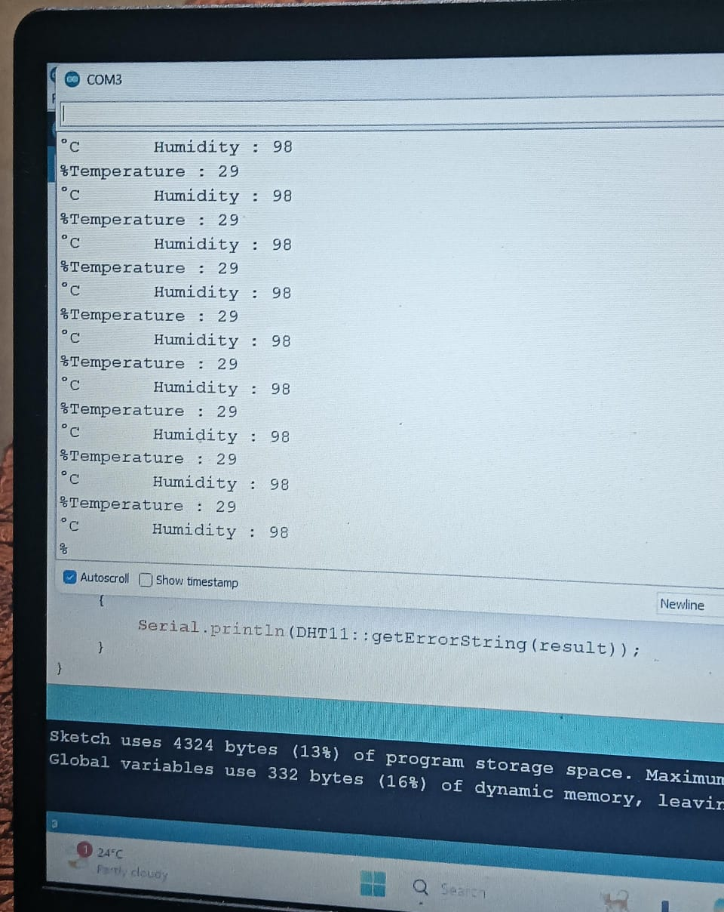

# DHT11 Temperature and Humidity Monitoring

## Overview

This project demonstrates temperature and humidity monitoring using the DHT11 sensor with an Arduino.

## Components Used

- Arduino Uno
- DHT11 Temperature and Humidity Sensor
- Jumper Wires

## Features

- Measures temperature in °C
- Measures relative humidity in %
- Displays the readings on the Serial Monitor

## Hardware Connection

The DHT11 sensor is connected to the Arduino for measuring temperature and humidity.

## Output

The sensor readings are displayed on the Arduino Serial Monitor.

- Temperature: **29 °C**
- Humidity: **98 %**

